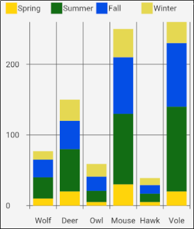
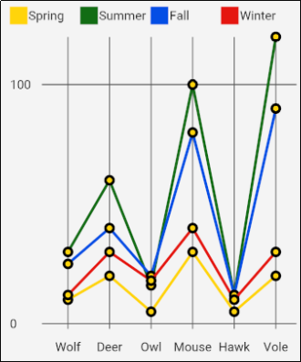
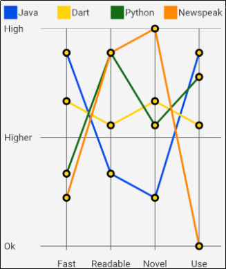
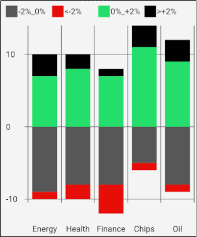

<h2>Table of Contents</h2>

<ul>
<li><a href="#sec-1">1. Table of contents&#xa0;&#xa0;&#xa0;TOC</a></li>
<li><a href="#sec-2">2. Flutter Charts - an introduction</a></li>
<li><a href="#sec-3">3. Sample Flutter Charts application output</a></li>
<li><a href="#sec-4">4. Known packages, libraries and apps that use this this flutter_charts package</a></li>
<li><a href="#sec-5">5. Flutter Charts - an overview: data, options, classes</a></li>
<li><a href="#sec-6">6. Experimenting with Flutter Charts: Using the included sample app flutter_charts_sample_app.dart</a></li>
<li><a href="#sec-7">7. Flutter Charts - samples: LineChart and VerticalBarChart. Code and resulting charts</a>
<ul>
<li><a href="#sec-7-1">7.1. Random Data (Y values), Random X Labels, Random Colors, Random Data Rows Legends, Data-Generated Y Labels.</a></li>
<li><a href="#sec-7-2">7.2. User-Provided Data (Y values), User-Provided X Labels, Random Colors, User-Provided Data Rows Legends, Data-Generated Y Labels,</a></li>
<li><a href="#sec-7-3">7.3. User-Provided Data (Y values), User-Provided X Labels, Random Colors, User-Provided Data Rows Legends, User-Provided Y Labels</a></li>
</ul>
</li>
<li><a href="#sec-8">8. VerticalBar Chart - one more example, showing positive/negative stacks:</a>
<ul>
<li><a href="#sec-8-1">8.1. User-Provided Data (Y values), User-Provided X Labels, User-Provided Colors, User-Provided Data Rows Legends, User-Provided Y Labels</a></li>
</ul>
</li>
<li><a href="#sec-9">9. Bugs status</a></li>
<li><a href="#sec-10">10. Future enhancements and work</a></li>
<li><a href="#sec-11">11. TODO Terminology and Selected Classes</a></li>
<li><a href="#sec-12">12. Internal notes</a>
<ul>
<li><a href="#sec-12-1">12.1. DONE Add ability to create a Table of Contents to README.org</a></li>
<li><a href="#sec-12-2">12.2. TODO Conversion of README.org to README.md - steps</a></li>
<li><a href="#sec-12-3">12.3. TODO Add link to known client packages</a></li>
<li><a href="#sec-12-4">12.4. TODO <b>Flutter_charts publish workflow</b>  - Publish flutter_charts on pub</a></li>
</ul>
</li>
</ul>

# Table of contents     :TOC:

-   Flutter Charts - an introduction (See section )
-   Sample Flutter Charts application output (See section )
-   Known packages, libraries and apps that use this this flutter\_charts package (See section )
-   Flutter Charts - an overview: data, options, classes (See section )
-   Experimenting with Flutter Charts: Using the included sample app flutter\_charts\_sample\_app.dart (See section )
-   Flutter Charts - samples: LineChart and VerticalBarChart. Code and resulting charts (See section )
    -   Random Data (Y values), Random X Labels, Random Colors, Random Data Rows Legends, Data-Generated Y Labels. (See section )
    -   User-Provided Data (Y values), User-Provided X Labels, Random Colors, User-Provided Data Rows Legends, Data-Generated Y Labels, (See section )
    -   User-Provided Data (Y values), User-Provided X Labels, Random Colors, User-Provided Data Rows Legends, User-Provided Y Labels (See section )
-   VerticalBar Chart - one more example, showing positive/negative stacks: (See section )
    -   User-Provided Data (Y values), User-Provided X Labels, User-Provided Colors, User-Provided Data Rows Legends, User-Provided Y Labels (See section )
-   Bugs status (See section )
-   Future enhancements and work (See section )
-   Terminology and Selected Classes (See section )
-   Internal notes (See section )
    -   Add ability to create a Table of Contents to README.org (See section )
    -   Conversion of README.org to README.md - steps (See section )
    -   Add link to known client packages (See section )
    -   **Flutter\_charts publish workflow**  - Publish flutter\_charts on pub (See section )

# Flutter Charts - an introduction

Flutter Charts is a charting library for Flutter, written in Flutter. Currently, column chart and line chart are supported.

It is published on pub in 

You may want to study the included sample app `flutter_charts_sample_app.dart` to build your application using Flutter Charts. The sample app shows how a Flutter Chart can be included in a Flutter application.

# Sample Flutter Charts application output

There is one sample application in flutter\_charts: example/chart/chart\_usage\_example.dart. You can run the application using one of the methods (6, 7) in the paragraph below.

This application is also used as a base to show several possible sample charts in the paragraphs below. Two samples:

Vertical Bar Chart (Column Chart)

Point and Line Chart (Line Chart)

Output uses semi-random data. You can click the blue + button to rerun chart with a different dataset.

# Known packages, libraries and apps that use this this flutter\_charts package

1.  Michael R. Fairhurst's **Language reader app** - see <https://github.com/MichaelRFairhurst/flutter-language-reader-app>

# Flutter Charts - an overview: data, options, classes

Before we show several examples of charts, a few notes. 

-   The `ChartData` class: allows to define data - X labels, Y values, (optional) Y labels, each-dataRow (series) legends, each-dataRow (series) color. The list below provides a summary description of each item
    -   X labels: `ChartData.xLabels` allow to define X labels. Setting `xLabels` is required, but client can set them to empty strings.
    -   Y values: `ChartData.dataRows` allow to define Y values in rows. Assumption: size of each data row in `ChartData.dataRows` is the same, and each data row size ==  `ChartData.xLabels.size`
    -   Y labels (optional): Normally, Y labels are generated from data. The option `ChartOptions.useUserProvidedYLabels` (default *true*), asks flutter\_charts to data-generate Y labels. If this option is set to *false*, then `ChartData.yLabels` must be set. Any number of such user-provided Y labels is allowed.
    -   Each-dataRow (each series) legends: `ChartData.dataRowsLegends` allow to define a legend for each data row in  `ChartData.dataRows`. Assumption:  `ChartData.dataRows.size` ==  `ChartData.dataRowsLegends.size`
    -   Each-dataRow (each series) color: `ChartData.dataRowsColors` allow to define a color for each data row in  `ChartData.dataRows`. Assumption:  `ChartData.dataRows.size` ==  `ChartData.dataRowsColors.size`
-   The  `ChartOptions` class: allows to define options, by using it's defaults, or setting some options to non default values. There are also `LineChartOptions` and `VerticalBarChartOptions` classes.
-   Support for randomly generated data, colors, labels: Flutter Charts also provides randomly generated data, in the class `RandomChartData`. This class generates:
    -   Y values data,
    -   X labels,
    -   Series colors,
    -   Series legends
-   Currently the only purpose of `RandomChartData` is for use in the examples below. To be clear, `RandomChartData` Y values, series colors, and series legends are not completely random - they hardcode some demoable label, legends, color values, and data ranges (data random within the range).

# Experimenting with Flutter Charts: Using the included sample app flutter\_charts\_sample\_app.dart

There are multiple ways to experiment with Flutter Charts from your computer. We describe running Flutter Charts in development mode on your device (Android, iOS - follow 1, 2 or 3, 4 and 6), or alternatively on a device emulator (device emulator running from an IDE such as IntelliJ with Android Studio installed - follow 1, 2 or 3, 5, 6 or 7).

1.  Install Flutter on your computer. See <https://flutter.io/> installation section.
2.  Clone flutter\_charts code from Github to your computer. Needs git client.
    
        cd DIRECTORY_OF_CHOICE
        git clone https://github.com/mzimmerm/flutter_charts.git
        # clone will create directory  flutter_charts
        cd flutter_charts

3.  (Alternative to 2.): Download and unzip flutter\_charts code from Github
    -   Browse to  <https://github.com/mzimmerm/flutter_charts.git>
    -   On the righ top, click on the "Clone or Download" button, then select save Zip, save and extract to  DIRECTORY\_OF\_CHOICE
    -   cd flutter\_charts
4.  Prepare a physical device (must be set to Development Mode) to run applications from your computer. Then connect a android device in development mode to your computer. See <https://www.kingoapp.com/root-tutorials/how-to-enable-usb-debugging-mode-on-android.htm>

5.  (Alternative to 4.): Prepare and start an Android device emulator on your computer.
    -   Install Android Studio: see <https://developer.android.com/studio/index.html>
    
    -   Install an IDE such as IntelliJ with Flutter plugin. See <https://flutter.io/intellij-setup/>

6.  Run Flutter Charts demo app from command line (this will work in both method 4. and method 5.)
    
        cd DIRECTORY_OF_CHOICE/flutter_charts 
        flutter run example/chart/flutter_charts_sample_app.dart

7.  (Alternative to 6.) Run  Flutter Charts demo app from IDE. This will work only with method 5. 
    -   Start IntelliJ IDE, create a project in the `DIRECTORY_OF_CHOICE/flutter_charts` start an Android emulator, then click on the Run button in Intellij (which should see the flutter\_charts\_sample\_app)

# Flutter Charts - samples: LineChart and VerticalBarChart. Code and resulting charts

Flutter Charts code allow to define the following data elements:

<table border="2" cellspacing="0" cellpadding="6" rules="groups" frame="hsides">

<colgroup>
<col  class="left" />

<col  class="left" />
</colgroup>
<tbody>
<tr>
<td class="left">*Data (Y values)*</td>
<td class="left">User-Provided or Random</td>
</tr>

<tr>
<td class="left">*X Labels*</td>
<td class="left">User-Provided or Random</td>
</tr>

<tr>
<td class="left">*Options including Colors*</td>
<td class="left">User-Provided or Random</td>
</tr>

<tr>
<td class="left">*Data Rows Legends*</td>
<td class="left">User-Provided or Random</td>
</tr>

<tr>
<td class="left">*Y Labels*</td>
<td class="left">User-Provided or Data-Generated</td>
</tr>
</tbody>
</table>

The samples below show a few alternative code snippets (User-Provided or Random data, labels, option) and the resulting charts.

The chart images were obtained by substituting the code snippet to the `example/chart/flutter_charts_sample_app.dart` code. 

## Random Data (Y values), Random X Labels, Random Colors, Random Data Rows Legends, Data-Generated Y Labels.

This example shows that Data-Generated Y labels is the default.  
Flutter Charts support reasonably intelligently generated Y Labels from data, including dealing with negatives.

The example charts in this section are equivalent to those shown in "Sample Flutter Charts Application Output".

Code in `defineOptionsAndData()`:

    void defineOptionsAndData() {
      _lineChartOptions = new LineChartOptions();
      _verticalBarChartOptions = new VerticalBarChartOptions();
      _chartData = new RandomChartData(useUserProvidedYLabels: _lineChartOptions.useUserProvidedYLabels);
    }

Result line chart:

Result vertical bar chart:

## User-Provided Data (Y values), User-Provided X Labels, Random Colors, User-Provided Data Rows Legends, Data-Generated Y Labels,

Code in `defineOptionsAndData()`:

    void defineOptionsAndData() {
      _lineChartOptions = new LineChartOptions();
      _verticalBarChartOptions = new VerticalBarChartOptions();
      _chartData = new ChartData();
      _chartData.dataRowsLegends = [
        "Spring",
        "Summer",
        "Fall",
        "Winter"];
      _chartData.dataRows = [
        [10.0, 20.0,  5.0,  30.0,  5.0,  20.0, ],
        [30.0, 60.0, 16.0, 100.0, 12.0, 120.0, ],
        [25.0, 40.0, 20.0,  80.0, 12.0,  90.0, ],
        [12.0, 30.0, 18.0,  40.0, 10.0,  30.0, ],
      ];
      _chartData.xLabels =  ["Wolf", "Deer", "Owl", "Mouse", "Hawk", "Vole"];
      _chartData.assignDataRowsDefaultColors();
      // Note: ChartOptions.useUserProvidedYLabels default is still used (false);
    }

Result line chart:

Result vertical bar chart:

## User-Provided Data (Y values), User-Provided X Labels, Random Colors, User-Provided Data Rows Legends, User-Provided Y Labels

This example show how to use the option `useUserProvidedYLabels`, and scaling of data to the Y labels range.

Code in `defineOptionsAndData()`:

    void defineOptionsAndData() {
      // This example shows user defined Y Labels.
      //   When setting Y labels by user, the dataRows value scale
      //   is irrelevant. User can use for example interval <0, 1>,
      //   <0, 10>, or any other, even negative ranges. Here we use <0-10>.
      //   The only thing that matters is  the relative values in the data Rows.
    
      // Note that current implementation sets
      // the minimum of dataRows range (1.0 in this example)
      // on the level of the first Y Label ("Ok" in this example),
      // and the maximum  of dataRows range (10.0 in this example)
      // on the level of the last Y Label ("High" in this example).
      // This is not desirable, we need to add a userProvidedYLabelsBoundaryMin/Max.
      _lineChartOptions = new LineChartOptions();
      _verticalBarChartOptions = new VerticalBarChartOptions();
      _chartData = new ChartData();
      _chartData.dataRowsLegends = [
        "Java",
        "Dart",
        "Python",
        "Newspeak"];
      _chartData.dataRows = [
        [9.0, 4.0,  3.0,  9.0, ],
        [7.0, 6.0,  7.0,  6.0, ],
        [4.0, 9.0,  6.0,  8.0, ],
        [3.0, 9.0, 10.0,  1.0, ],
      ];
      _chartData.xLabels =  ["Fast", "Readable", "Novel", "Use"];
      _chartData.dataRowsColors = [
        Colors.blue,
        Colors.yellow,
        Colors.green,
        Colors.amber,
      ];
      _lineChartOptions.useUserProvidedYLabels = true; // use the labels below on Y axis
      _chartData.yLabels = [
        "Ok",
        "Higher",
        "High",
      ];
    }

Result line chart:

(Disclaimer: Not actually measured)

Result vertical bar chart: Here the Y values should be numeric (if any) as manual labeling "Ok", "Higher", High" does not make sense for stacked type charts.

(Disclaimer: Not actually measured)

# VerticalBar Chart - one more example, showing positive/negative stacks:

## User-Provided Data (Y values), User-Provided X Labels, User-Provided Colors, User-Provided Data Rows Legends, User-Provided Y Labels

This example has again user defined Y Labels, with a bar chart, using the smart auto-layout of user defined Y Labels. The chart shows negative and positive values similar to %down/%up stock charts.

Code in `defineOptionsAndData()`:

    void defineOptionsAndData() {
      // This example shows user defined Y Labels with
      // a bar chart, showing negative and positive values
      // similar to %down/%up stock charts.
      _lineChartOptions = new LineChartOptions();
      _verticalBarChartOptions = new VerticalBarChartOptions();
      _chartData = new ChartData();
      _chartData.dataRowsLegends = [
        "-2%_0%",
        "<-2%",
        "0%_+2%",
        ">+2%"];
      // each column absolute values should add to same number todo - 100 would make more sense, to represent 100% of stocks in each category
      _chartData.dataRows = [
        [-9.0, -8.0,  -8.0,  -5.0, -8.0, ],
        [-1.0, -2.0,  -4.0,  -1.0, -1.0, ],
        [7.0, 8.0,  7.0, 11.0, 9.0, ],
        [3.0, 2.0, 1.0,  3.0,  3.0, ],
      ];
      _chartData.xLabels =  ["Energy", "Health", "Finance", "Chips", "Oil"];
      _chartData.dataRowsColors = [
        Colors.grey,
        Colors.red,
        Colors.greenAccent,
        Colors.black,
      ];
      _lineChartOptions.useUserProvidedYLabels = false; // use labels below
      //_chartData.yLabels = [
      //  "Ok",
      //  "Higher",
      //  "High",
      //];
    }

Result vertical bar chart:

(there is a bug here,see Known Bugs)

# Bugs status

-   [ ] Chart area needs clipping in the application
-   [ ] Take a look at the stock charts example. There is a bug reverting series on the negative values - both negative dataRows, and dataRowsColors must be reverted for the chart stacks to show in intended order (black, green grey red from top). But even then,  dataRowsLegends are incorrect.
-   [X] <https://github.com/mzimmerm/flutter_charts/issues/5> - Coloring support: Make line chart dot colors settable
-   [ ] 

# Future enhancements and work

Bug fixes:

-   Clip chart to not paint outside area provided by Flutter app.
-   Clip labels and legends not to run into the neighbor, if too long.

On the boundary of bug and enhancement:

-   For ChartOptions.useUserProvidedYLabels = true. See example with User defined YLabels: Current implementation sets the minimum of dataRows range (1.0 in the example) on the level of the first Y Label ("Ok" in this example), and the maximum  of dataRows range (10.0 in this example) on the level of the last Y Label ("High" in this example). This is not desirable, we need to add a userProvidedYLabelsBoundaryMin/Max.

Enhancements:

-   Create document / image showing layout and spacing - show option variables on image
-   Simple:
    -   Add options to hide the grid (keep axes)
    -   Add options to hide  axes (if axes not shown, labels should not show?)
    -   Decrease option for default spacing around the Y axis.
-   First, probably need to provide tooltips
-   Next, a few more chart types: Spline line chart (stacked line chart), Grouped VerticalBar chart,
-   Next, re-implement the layout more generically and clearly. Space saving changes such as *tilting* labels.
-   Next, add ability to invert X and Y axis (values on horizontal axis)

# TODO Terminology and Selected Classes

-   **(Presenter)Leaf      :** The finest visual element presented in each  "column of view" in chart - that is, all widgets representing series of data displayed above each X label. For example, for Line chart, the leaf would be one line and dot representing one Y value at one X label. For the bar chart, the leaf would be one bar representing one (stacked) Y value at one X label.
    -   Classes: Presenter, LineAndHotspotPresenter, VerticalBarPresenter, PresenterCreator
-   **Painter              :** Class which paints to chart to canvas. Terminology and class structure taken from Flutter's Painter and Painting classes.
    -   Classes: todo

# Internal notes

## DONE Add ability to create a Table of Contents to README.org

-   Install toc-org package
-   Add to init.el
    
        (if (require 'toc-org nil t)
          (add-hook 'org-mode-hook 'toc-org-enable)
        (warn "toc-org not found"))
-   Every time README.org is saved, first heading with a :TOC: tag will be updated with the current table of contents.
-   So nothing special need be done after the above is configured.

## TODO Conversion of README.org to README.md - steps

## TODO Add link to known client packages

## TODO **Flutter\_charts publish workflow**  - Publish flutter\_charts on pub

-   [ ] **If needed**: Change and save README.org if applicable. This updates the TOC.
-   [ ] **If needed**: Convert README.org to README.md  - Just C-c C-e m m
-   [ ] increase `version:` in pubspec.yaml
-   [ ] `cd flutter_charts; flutter packages pub upgrade`
-   [ ] `cd flutter_charts; flutter packages pub get`
-   [ ] \*Test included app from Idea~
-   [ ] `git push`
-   [ ] `flutter packages pub publish --dry-run`
-   [ ] `flutter packages pub publish`
-   [ ] Check <https://pub.dartlang.org/packages/flutter_charts>
-   [ ] Optionally, **test the flutter\_charts\_sample\_app** - this tests the published package
    -   [ ] `cd flutter_charts_sample_app; flutter packages pub upgrade; flutter packages pub get; flutter run`
-